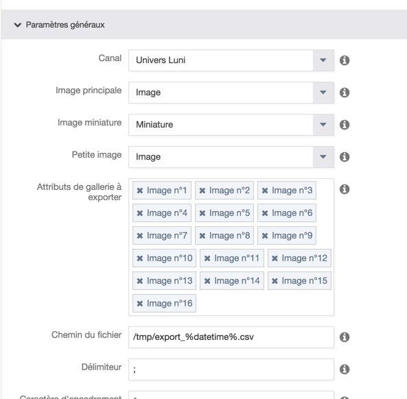

# Akeneo Connector Utils

## TL;DR

This component brings tools and utilities for connectors developers.

This adapter brings :

 * XML data source parsing tools
 * Attribute option value discovering
 * Attribute list input
 * Assets processor (images attributes)
 * Variant group assets export
 * Dummy reader/processor/writer
 * Utility traits for your connectors
 
## Versions

| PIM version | Component version |
|:-----------:|:-----------------:|
| 1.5.*       | 1.1.*             | 
| 1.4.*       | 1.0.*             |

Note : From version 1.1, namespace changed from `Luni\Component\Connector` to `Kiboko\Component\Connector`
 
## Utilities

### `ConfigurationAwareTrait`

This trait fixed features in `Akeneo\Component\Batch\Item\AbstractConfigurableStepElement`,
the `getConfiguration` method requires public attributes to be defined, but in lots of cases,
you may not want to expose your configuration handlers.

```php
<?php

use Akeneo\Component\Batch\Item\AbstractConfigurableStepElement;
use Akeneo\Component\Batch\Item\ItemReaderInterface;
use Akeneo\Component\Batch\Step\StepExecutionAwareInterface;
use Luni\Component\Connector\ConfigurationAwareTrait;
use Luni\Component\Connector\NameAwareTrait;
use Luni\Component\Connector\StepExecutionAwareTrait;

class FooReader
    extends AbstractConfigurableStepElement
    implements ItemReaderInterface, StepExecutionAwareInterface
{
    use StepExecutionAwareTrait;
    use ConfigurationAwareTrait;
    use NameAwareTrait;

    public function getConfigurationFields()
    {
        // ...
    }

    /**
     * {@inheritdoc}
     */
    public function read()
    {
        // ...
    }
}
```

### `AttributeManager`

This helps you to create parametrable connectors:

```php
<?php

$attributeManager = new Luni\Component\Connector\Manager\AttributeManager($attributeRepository);
$attributeManager->getAttributeChoices('pim_catalog_image'),
```
 
This is used for a media assets exporting job, like [`ProductAssetsProcessor`](#productassetsprocessor)

### `DummyReader`, `DummyProcessor` and `DummyWriter`

Those steps are used to stub your WiP connectors.

In your bundle, you will need theses configurations:

```yaml
# Resources/config/readers.yml
parameters:
    luni_connector.reader.dummy_item.class: Luni\Component\Connector\Processor\DummyReader

services:
    luni_connector.reader.dummy_item:
        class: '%luni_connector.reader.dummy_item.class%'
```

```yaml
# Resources/config/processors.yml
parameters:
    luni_connector.processor.dummy_item.class: Luni\Component\Connector\Processor\DummyProcessor

services:
    luni_connector.processor.dummy_item:
        class: '%luni_connector.processor.dummy_item.class%'
```

```yaml
# Resources/config/writers.yml
parameters:
    luni_connector.writers.dummy_item.class: Luni\Component\Connector\Processor\DummyWriter

services:
    luni_connector.writers.dummy_item:
        class: '%luni_connector.writers.dummy_item.class%'
```

### `ProductAssetsProcessor`

This processor is suited for Magento assets exporting from Akeneo CE, when you have created multiple image attributes



In your bundle, you will need theses configurations:

```yaml
# Resources/config/processors.yml
parameters:
    luni_assets.processor.image.product.class: Luni\Component\Connector\Processor\ProductAssetsProcessor

services:
    luni_assets.processor.product.image:
        class: '%luni_assets.processor.image.product.class%'
        arguments:
            - '@luni_assets.manager.attributes'
            - '@pim_serializer'
```

```yaml
# Resources/config/managers.yml
parameters:
    luni_assets.manager.attributes.class: Luni\Component\Connector\Manager\AttributeManager

services:
    luni_assets.manager.attributes:
        class: '%luni_assets.manager.attributes.class%'
        arguments:
            - '@pim_catalog.repository.attribute'
```

